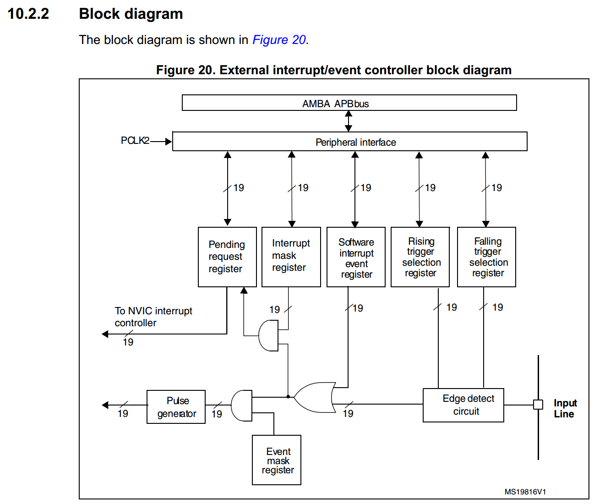
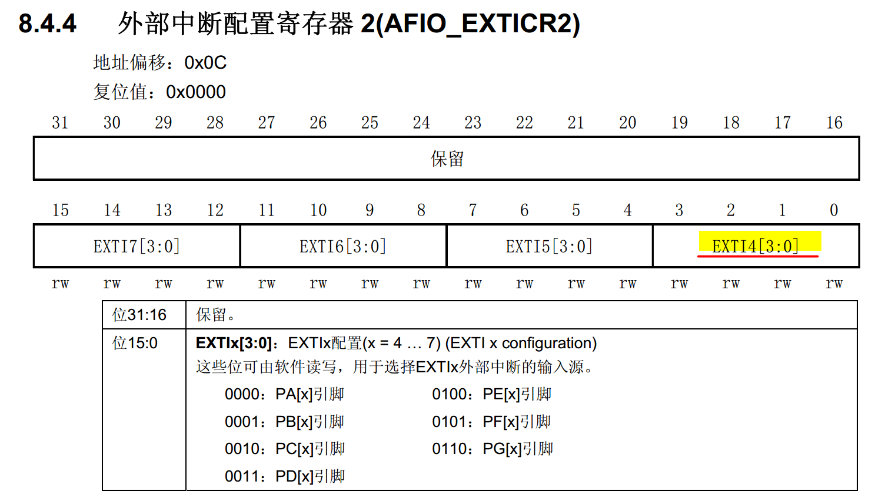
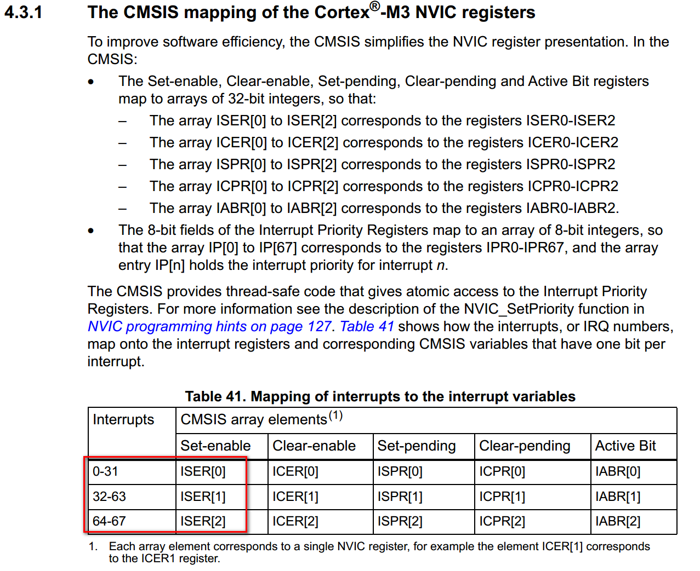
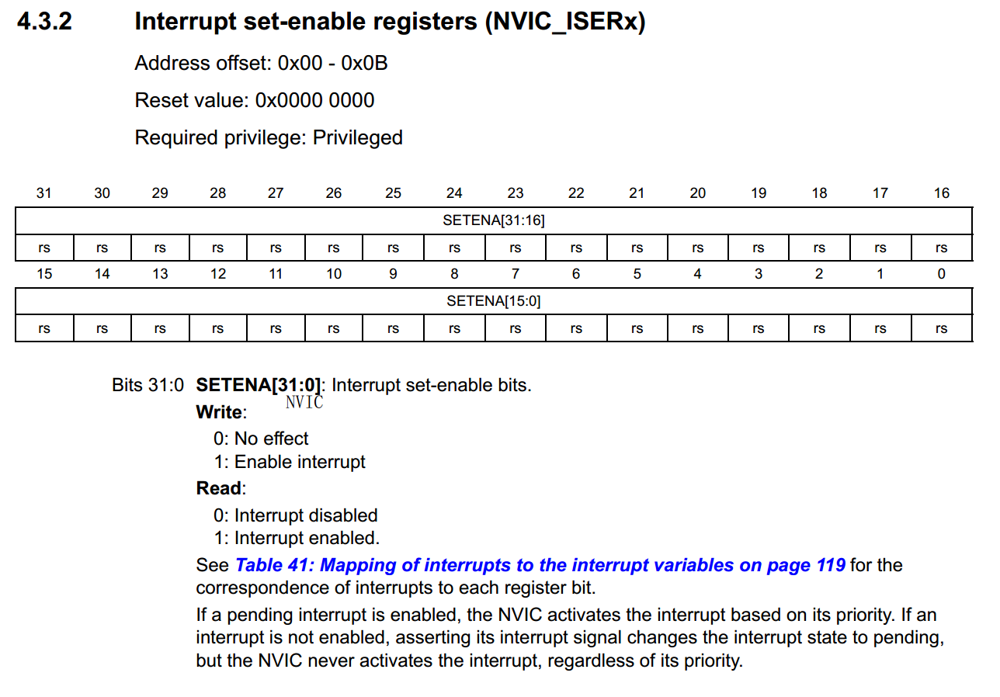
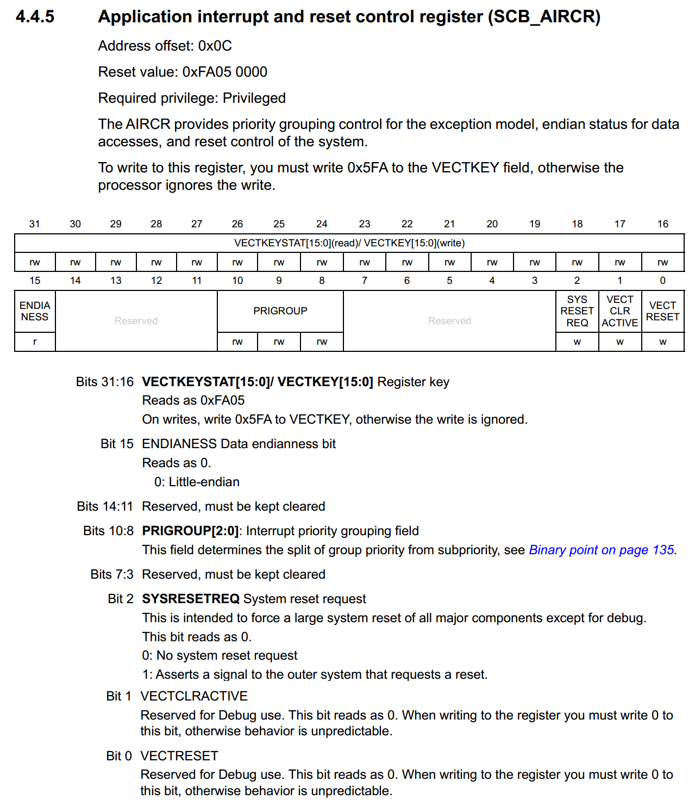
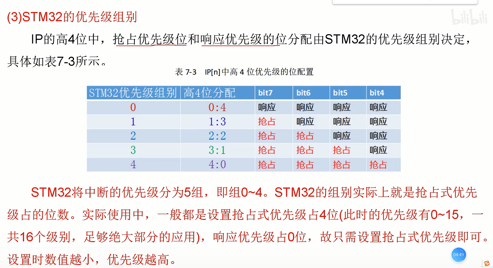

总来说中断流程是可以参考这个图

①初始化IO口为输入

	GPIOE_CRL &= ~(0XF << 16);
	GPIOE_CRL |= 0x8 << 16;// 设置PE4 上下拉输入模式 2MHZ
	GPIOE->ODR|=1<<4;	   	//PE4 上拉 
②开启IO口复用时钟

  	RCC->APB2ENR |= 1<<6; // 使能APB2总线时钟
  	RCC->APB2ENR|=0x01;//使能io复用时钟	

③设置IO口与中断线的映射关系

  	AFIO->EXTICR[1] &= 0xfff0; 
  	AFIO->EXTICR[1] |= 0xfff4; // PE4 配置为外部中断4

④初始化线上中断，设置触发条件等

  	EXTI->IMR |= 1<<4; // 放开来自线4上的中断
  	EXTI->FTSR |= 1<<4; // 允许线4的下降沿触发中断

⑤配置中断分组（NVIC），并使能中断

  	temp = SCB->AIRCR; // 读取先前的值
  	temp &= 0X0000F8FF;  // 清空高位，并给BIT[10：8] 置0
  	temp |= (0X05FA<<16 | (7 - group) << 8);  // 设置秘钥并设置优先级分组
  	SCB->AIRCR = temp;
  	
  	NVIC->ISER[interrupt_channel/32] |= (1<<(interrupt_channel%32)); // 使能EXIT4 中断位 interrupt_channel是中断表中的中断通道号
  	NVIC->IP[interrupt_channel] = priority << 4;  //IPn[7:4] 表示优先级：假如当前中断优先级priority =0x7 (0111,表示 抢占3，响应1)

⑥编写中断服务函数

	//外部中断4服务程序
	void EXTI4_IRQHandler(void)
	{
		unsigned char i = 0;
		delay_ms(10);	//消抖
		if(KEY0==0)	 	//按键KEY0
		{
			for(;i<5;i++) {
				BEEP=1;
				LED_RED = ~LED_RED;
				delay_ms(100);
				BEEP=0;
				LED_RED = ~LED_RED;
				delay_ms(100);
			}
		}		 
		EXIT1->PR=1<<4;  //清除LINE4上的中断标志位  
	}	

⑦清除中断标志位

	EXIT1->PR=1<<4;  //清除LINE4上的中断标志位

**说明**

1. 步骤3中为何选择 AFIO->EXTICR[1] 这一位呢？

​       因为我们的按键是在PE4引脚上，4引脚对应的中断。

2. 步骤5中通过设置NIVC_ISER[?] 的使能对应通道中断号,那么 ？这个数组角标到底是多少呢？看M3的手册ISER寄存器介绍

所以根据对应终端号在这里确认 ？ 是多少(例如外部中断4 EXIT4的终端号是10，在0-31中，所以？=0)。ISER 是用来控制NVIC 中断的使能的寄存器。

3. 通过 SCB->AIRCR 设置中断的分组

看AIRCR寄存器，人家要求要写密钥，并通过 ARICR[10:8]设置分组

在这个寄存器的Bit[10:8] 设置中断优先级分组

如果优先级组设置为4：

  当前中断只能设置抢占优先级（0 ~ 15），无响应优先级可设置

如果 优先级组设置为3：

​	当前中断可设置的 抢占的级别（0 ~ 7）+ 响应可设置为（0 ~ 1） 

如果优先级组设置为2：

   当前中断可设置为 抢占的级别（0 ~ 3）+ 响应可设置为（0 ~ 3）

如果优先级组设置为1：

  当前中断可设置为 抢占的级别（0 ~ 1）+ 响应可设置为（0 ~ 7）

如果优先级组设置为0：

   当前中断无抢占优先级可设置，响应优先级可设置（0 ~ 15）

优先级设置好 通过  16进制标识给 NVIC->IP[7:4] 赋值

了解了这些，再看

	temp = SCB->AIRCR; // 读取先前的值
	temp &= 0X0000F8FF;  // 清空高位，并给BIT[10：8] 置0
	temp |= (0X05FA<<16 | (7 - group) << 8);  // 设置秘钥并设置优先级分组
	SCB->AIRCR = temp;
	
	NVIC->ISER[interrupt_channel/32] |= (1<<(interrupt_channel%32)); // 使能EXIT4 中断位 interrupt_channel是中断表中的中断通道号
	NVIC->IP[interrupt_channel] = priority << 4;  //IPn[7:4] 表示优先级：假如当前中断优先级priority =0x7 (0111,表示 抢占3，响应1)

就简单了。

参考：

[STM32中断管理](https://www.bilibili.com/medialist/play/ml716340014/BV1nS4y1q7su?spm_id_from=333.999.0.0&oid=726981778&otype=2)

[ST公司的cortex-m3内核说明](https://www.st.com/resource/en/programming_manual/cd00228163-stm32f10xxx-20xxx-21xxx-l1xxxx-cortex-m3-programming-manual-stmicroelectronics.pdf)

STM32中文手册

STM32英文手册
